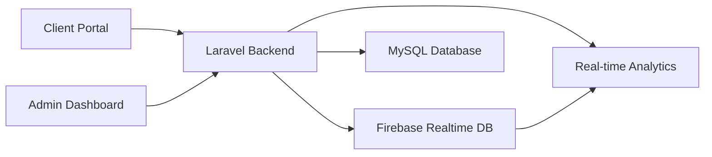

<div align="center">

# 🏨 LodgeEase
### Modern Hotel & Lodge Management System

[](https://laravel.com)
[](https://php.net)
[](https://firebase.google.com)
[](https://tailwindcss.com)
[](https://vitejs.dev)
[](LICENSE)

**A comprehensive hotel management solution with real-time booking, business analytics, and streamlined operations**

[Features](#-features) • [Installation](#-installation) • [Tech Stack](#-technology-stack) • [Documentation](#-documentation)

---

</div>

## ✨ Features

<table>
<tr>
<td width="50%">

### 🏠 Client Portal
- 🌐 **Responsive Home Interface** - Modern, mobile-friendly design
- 🔍 **Room Browse & Search** - Interactive catalog with filtering
- ⚡ **Real-time Availability** - Live room status checking
- 📅 **Booking System** - Streamlined reservation process
- 🔐 **Guest Authentication** - Secure login and profiles

</td>
<td width="50%">

### 🎛️ Admin Dashboard
- 📊 **Comprehensive Dashboard** - Real-time metrics & KPIs
- 🏨 **Room Management** - Complete inventory control
- 📋 **Booking Requests** - Centralized reservations
- 📈 **Business Analytics** - Advanced insights
- 📝 **Activity Logging** - Real-time tracking
- ⚙️ **Settings Management** - System configuration
- 🤖 **AI Chatbot** - Automated support

</td>
</tr>
<tr>
<td width="50%">

### 📊 Analytics & Reporting
- 💰 **Revenue Analytics** - Monthly tracking & forecasting
- 📈 **Occupancy Trends** - Historical & predictive analysis
- 📅 **Booking Trends** - Pattern analysis
- 🏆 **Room Performance** - Profitability metrics
- 👥 **Guest Demographics** - Customer insights
- 🌡️ **Seasonal Analysis** - Performance tracking
- 📤 **Export Capabilities** - JSON/CSV formats

</td>
<td width="50%">

### 🔍 Activity Monitoring
- ⚡ **Real-time Logs** - Live activity tracking
- 🔎 **Advanced Filtering** - Multi-criteria search
- 📝 **Comprehensive Logging** - All system events
- ⏱️ **Performance Metrics** - Resource tracking
- ☁️ **Firebase Integration** - Cloud storage
- 🎯 **Visual Indicators** - Status badges

</td>
</tr>
</table>

### 🚀 Technical Highlights


- ⚡ **Performance Optimized** - Modal optimization, lazy loading
- 🔄 **Real-time Sync** - Live data synchronization across clients
- 🎨 **Modern UI/UX** - Clean, intuitive interface design
- 🏗️ **Component Architecture** - Reusable, maintainable code
- 📱 **Mobile Responsive** - Works seamlessly on all devices
- 🔐 **Secure** - Laravel authentication & Firebase security

---

## 🛠️ Technology Stack

<div align="center">

### Backend Technologies


**Laravel 12.x** • **PHP 8.2+** • **Firebase Realtime Database** • **MySQL**

### Frontend Technologies


**TailwindCSS 4.0** • **Vite 7.x** • **Alpine.js** • **Chart.js** • **Axios**

### Development Tools


**Laravel Pint** • **PHPUnit** • **Laravel Sail** • **Git**

</div>

---

## 📋 Requirements

| Requirement | Version |
|------------|---------|
| 🐘 PHP | 8.2 or higher |
| 📦 Composer | 2.x |
| 🟢 Node.js | 18.x or higher |
| 📦 npm/yarn | Latest |
| 🔥 Firebase | Realtime Database |
| 🌐 Web Server | Apache/Nginx or Laravel dev server |

---

## 🚀 Installation

### Step 1: Clone the Repository
```bash
git clone https://github.com/JordanFontanilla/LodgeEaseRE.git
cd LodgeEaseRE
```

### Step 2: Install PHP Dependencies
```bash
composer install
```

### Step 3: Install Node Dependencies
```bash
npm install
```

### Step 4: Environment Setup
```bash
cp .env.example .env
php artisan key:generate
```

### Step 5: Configure Firebase

> **📌 Important:** Firebase is required for real-time features

1. **Create Firebase Project**
   - Visit [Firebase Console](https://console.firebase.google.com)
   - Create a new project
   - Enable **Realtime Database**

2. **Download Service Account**
   - Go to Project Settings → Service Accounts
   - Generate new private key (JSON file)
   - Save as `storage/app/firebase/firebase_credentials.json`

3. **Update Environment Variables**
   ```env   ```env
   FIREBASE_PROJECT_ID=your-project-id
   FIREBASE_DATABASE_URL=https://your-project-default-rtdb.firebaseio.com/
   ```

### Step 6: Build Assets
```bash
# Development (with hot reload)
npm run dev

# Production build
npm run build
```

### Step 7: Initialize Firebase Database
```bash
php artisan firebase:init
```

### Step 8: Start Development Server
```bash
php artisan serve
```

🎉 **Visit** `http://localhost:8000` to access the application!

---

## 📁 Project Structure

```
LodgeEaseRE/
├── 📂 app/
│   ├── 🎮 Http/Controllers/       # Application controllers
│   │   ├── AdminController.php
│   │   ├── BusinessAnalyticsController.php
│   │   ├── ActivityLogController.php
│   │   └── RoomController.php
│   ├── 📊 Models/                 # Eloquent models
│   │   ├── Room.php
│   │   ├── Booking.php
│   │   └── ActivityLog.php
│   └── 🔧 Services/
│       └── FirebaseService.php    # Firebase integration
├── 📂 resources/
│   ├── 🎨 views/                  # Blade templates
│   │   ├── admin/                 # Admin dashboard
│   │   ├── client/                # Client portal
│   │   └── components/            # Reusable components
│   ├── ⚡ js/                     # JavaScript assets
│   │   ├── activity-log.js
│   │   ├── business-analytics.js
│   │   ├── firebase-service.js
│   │   ├── room-management.js
│   │   └── loading-screen.js
│   └── 🎨 css/                    # Stylesheets
│       ├── app.css
│       └── loading-screen.css
├── 🛣️ routes/
│   └── web.php                    # Application routes
├── 🌐 public/
│   └── build/                     # Compiled assets
└── 📦 storage/
    └── app/firebase/              # Firebase credentials
```

---

## 🎯 Key Features Deep Dive

<details>
<summary><b>📊 Business Analytics Dashboard</b></summary>

<br>

- **KPI Monitoring**: Real-time tracking of total sales, occupancy rates, and seasonal performance
- **Revenue Analysis**: Monthly revenue trends with comparative analysis
- **Booking Insights**: Comprehensive booking pattern analysis with status tracking
- **Room Performance**: Individual room profitability and utilization metrics
- **Export Functionality**: Data export capabilities for external analysis

**Supported Metrics:**
- Total Sales (Last 30 days with trend comparison)
- Current Occupancy Rate (with target benchmarks)
- Average Sales per Booking
- Seasonal Performance Score
- Month-over-month growth rates

</details>

<details>
<summary><b>📝 Activity Log System</b></summary>

<br>

- **Real-time Tracking**: Live activity monitoring with automatic refresh (always active)
- **Advanced Filtering**: Multi-parameter filtering by action, category, severity, admin, and date range
- **Performance Metrics**: Built-in performance monitoring with memory and request duration tracking
- **Firebase Integration**: Cloud-based storage with real-time synchronization
- **Comprehensive Logging**: All system activities including logins, room updates, booking approvals
- **Visual Indicators**: Green pulsing "Real-time Active" status indicator

**Logged Activities:**
- User authentication (login/logout)
- Room management (create, update, delete)
- Booking operations (approve, reject, modify)
- Data exports and reports
- System configuration changes

</details>

<details>
<summary><b>⚡ Performance Optimizations</b></summary>

<br>
**Loading Screen Optimization:**
- Modal-aware loading screens that exclude modal interactions
- Smart automatic detection of modal contexts
- Performance-optimized for instant modal responses
- Backward compatible with existing functionality

**Database Optimization:**
- Unified `rooms_history` for complete booking lifecycle
- No duplicate checkout history collections
- Efficient Firebase queries for large datasets
- Real-time synchronization without page refreshes

**Build System:**
- Vite 7.x with hot module replacement (HMR)
- Code splitting and lazy loading
- Asset optimization and minification
- Fast development server with instant updates

</details>

---

## 🔧 Configuration

### Firebase Database Structure
```json
{
  "activity_logs": {
    "log_id": {
      "action": "LOGIN",
      "admin_id": "1",
      "timestamp": "2025-10-08T10:30:00Z"
    }
  },
  "rooms": {
    "room_1": {
      "room_number": 1,
      "status": "available",
      "current_checkin": null
    }
  },
  "rooms_history": {
    "history_id": {
      "room_number": 1,
      "guest_name": "John Doe",
      "check_in_date": "2025-10-07",
      "checked_out": false,
      "status": "active"
    }
  },
  "bookings": {},
  "admins": {},
  "settings": {}
}
```

### Environment Variables
```env
# Application
APP_NAME=LodgeEase
APP_ENV=production
APP_DEBUG=false
APP_URL=https://your-domain.com

# Firebase Configuration
FIREBASE_PROJECT_ID=your-project-id
FIREBASE_DATABASE_URL=https://your-project-default-rtdb.firebaseio.com/

# Database (if using MySQL alongside Firebase)
DB_CONNECTION=mysql
DB_HOST=127.0.0.1
DB_PORT=3306
DB_DATABASE=lodgeease
DB_USERNAME=root
DB_PASSWORD=
```

---

## 🧪 Testing

```bash
# Run all tests
php artisan test

# Run specific test suite
php artisan test --testsuite=Feature

# Run tests with coverage
php artisan test --coverage
```

---

## � Deployment

### Production Build
```bash
# Install dependencies
composer install --optimize-autoloader --no-dev
npm install

# Build production assets
npm run build

# Optimize Laravel
php artisan config:cache
php artisan route:cache
php artisan view:cache

# Set proper permissions
chmod -R 755 storage bootstrap/cache
```

### Server Requirements
- PHP 8.2+ with required extensions (OpenSSL, PDO, Mbstring, Tokenizer, XML, Ctype, JSON)
- Composer
- Node.js & npm
- Web server (Apache with mod_rewrite or Nginx)
- SSL certificate (recommended)

---

## 📚 Documentation

### API Endpoints

<details>
<summary><b>View API Routes</b></summary>

#### Admin Routes
```
GET  /admin/dashboard          - Admin dashboard
GET  /admin/rooms              - Room management
GET  /admin/analytics          - Business analytics
GET  /admin/activity-logs      - Activity logs
POST /admin/rooms/checkout     - Checkout guest
GET  /admin/rooms/{id}/details - Get room details
```

#### Client Routes
```
GET  /                         - Client homepage
GET  /rooms                    - Browse rooms
POST /booking                  - Create booking
```

</details>

### Firebase Integration

<details>
<summary><b>Firebase Service Methods</b></summary>

```php
// Get room with check-in data
FirebaseService::getRoomWithCheckin($roomNumber)

// Get all rooms with check-ins
FirebaseService::getAllRoomsWithCheckins()

// Checkout room (updates rooms_history)
FirebaseService::checkOutRoom($roomNumber, $checkoutData)

// Get checkout history
FirebaseService::getCheckoutHistory($limit, $offset)

// Log activity
FirebaseService::logActivity($type, $description, $adminId)
```

</details>

---

## 📈 Performance Features

| Feature | Description | Benefit |
|---------|-------------|---------|
| 🎯 **Modal Optimization** | Loading screens exclude modals | Instant modal interactions |
| ⚡ **Real-time Sync** | Live Firebase updates | No page refreshes needed |
| 🗄️ **Unified History** | Single `rooms_history` collection | No duplicate data |
| 🏗️ **Code Splitting** | Vite asset optimization | Faster page loads |
| 📱 **Mobile-First** | Responsive design | Works on all devices |
| 🔄 **HMR** | Hot module replacement | Faster development |

---

## 🤝 Contributing

Contributions are welcome! Please follow these steps:

1. **Fork the Repository**
2. **Create a Feature Branch**
   ```bash
   git checkout -b feature/AmazingFeature
   ```
3. **Commit Your Changes**
   ```bash
   git commit -m 'Add some AmazingFeature'
   ```
4. **Push to the Branch**
   ```bash
   git push origin feature/AmazingFeature
   ```
5. **Open a Pull Request**

### Contribution Guidelines
- Follow PSR-12 coding standards
- Write meaningful commit messages
- Add tests for new features
- Update documentation as needed
- Ensure all tests pass before submitting PR

---

## � Bug Reports

Found a bug? Please open an issue with:
- Clear description of the problem
- Steps to reproduce
- Expected vs actual behavior
- Screenshots (if applicable)
- Environment details (PHP version, browser, etc.)

---

## �📝 License

This project is licensed under the **MIT License** - see the [LICENSE](LICENSE) file for details.

```
MIT License

Copyright (c) 2025 LodgeEase - Hotel Management System

Permission is hereby granted, free of charge, to any person obtaining a copy
of this software and associated documentation files (the "Software"), to deal
in the Software without restriction...
```

---

## 👨‍💻 Author

**Jordan Fontanilla**
- GitHub: [@JordanFontanilla](https://github.com/JordanFontanilla)
- Repository: [LodgeEaseRE](https://github.com/JordanFontanilla/LodgeEaseRE)

---

## 🙏 Acknowledgments

- **Laravel** - The PHP framework for web artisans
- **Firebase** - Real-time database platform
- **TailwindCSS** - Utility-first CSS framework
- **Vite** - Next generation frontend tooling
- **Chart.js** - Simple yet flexible JavaScript charting
- **Alpine.js** - Lightweight JavaScript framework

---

## 📞 Support

Need help? Here's how to get support:

- 📖 [Documentation](#-documentation)
- 💬 [GitHub Issues](https://github.com/JordanFontanilla/LodgeEaseRE/issues)
- 📧 Email: Contact via GitHub

---

## 🗺️ Roadmap

### Upcoming Features
- [ ] Multi-language support
- [ ] Mobile app (iOS/Android)
- [ ] Payment gateway integration
- [ ] Email notifications
- [ ] SMS notifications
- [ ] Advanced reporting dashboard
- [ ] Guest loyalty program
- [ ] Integration with booking platforms
- [ ] Housekeeping management module
- [ ] Staff scheduling system

---

<div align="center">

## ⭐ Star This Repository

If you find this project useful, please consider giving it a star! ⭐

[](https://github.com/JordanFontanilla/LodgeEaseRE/stargazers)
[](https://github.com/JordanFontanilla/LodgeEaseRE/network/members)

---

**Made with ❤️ by Jordan Fontanilla**

**LodgeEase** © 2025 | All Rights Reserved

[⬆ Back to Top](#-lodgeease)

</div>
# LodgeEaseRE

